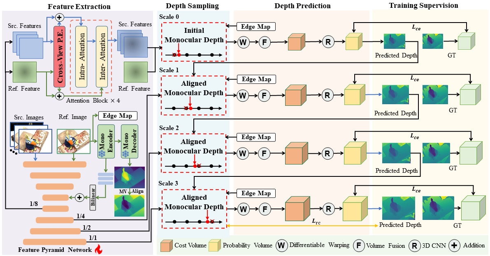

# **MonoMVSNet**

## [Arxiv](https://arxiv.org/abs/2507.11333) | [Pretrained Models](https://drive.google.com/drive/folders/1xf01LEp0IvEgFBhXxTq0jY4Duo7eiRJG?usp=drive_link)

> MonoMVSNet: Monocular Priors Guided Multi-View Stereo Network  
> Authors: Jianfei Jiang, Qiankun Liu*, Haochen Yu, Hongyuan Liu, Liyong Wang, Jiansheng Chen, Huimin Ma*   
> Institute: University of Science and Technology Beijing  
> ICCV 2025  

## 😀Abstract
Learning-based Multi-View Stereo (MVS) methods aim to predict depth maps for a sequence of calibrated images to recover dense point clouds. However, existing MVS methods often struggle with challenging regions, such as textureless regions and reflective surfaces, where feature matching fails. In contrast, monocular depth estimation inherently does not require feature matching, allowing it to achieve robust relative depth estimation in these regions. To bridge this gap, we propose MonoMVSNet, a novel monocular feature and depth guided MVS network that integrates powerful priors from a monocular foundation model into multi-view geometry. Firstly, the monocular feature of the reference view is integrated into source view features by the attention mechanism with a newly designed cross-view position encoding. Then, the monocular depth of the reference view is aligned to dynamically update the depth candidates for edge regions during the sampling procedure. Finally, a relative consistency loss is further designed based on the monocular depth to supervise the depth prediction. Extensive experiments demonstrate that MonoMVSNet achieves state-of-the-art performance on the DTU and Tanks-and-Temples datasets, ranking first on the Tanks-and-Temples Intermediate and Advanced benchmarks.

<p align="center">

</p>

## 🚀Installation

```bash
conda create -n monomvsnet python=3.10.8
conda activate monomvsnet
pip install -r requirements.txt
```
To reproduce the GPU memory consumption described in the paper, you need install `xformers`.

## ⭐Data Preparation

Please refer to [RRT-MVS](https://github.com/JianfeiJ/RRT-MVS).

You need download pretrained weights [depth_anything_v2_vits](https://drive.google.com/file/d/1M1JQWZ9jEa1H0lblt3B6yJU_LyjqF60_/view?usp=drive_link) and [TEED_model](https://drive.google.com/file/d/1j8wRHMozt_eJwBjs1JXxTDRboP_lKiSp/view?usp=drive_link) , then place them in the folder `pre_trained_weights`


## 🦴Training

### Training on DTU

To train the model on DTU, specify ``DTU_TRAINING`` in ``./scripts/train_dtu.sh`` first and then run:
```
bash scripts/train_dtu.sh
```
After training, you will get model checkpoints in `./checkpoints/dtu`.

### Finetune on BlendedMVS

To fine-tune the model on BlendedMVS, you need specify `BLD_TRAINING` and `BLD_CKPT_FILE` in `./scripts/train_bld.sh` first, then run:
```
bash scripts/train_bld.sh
```
After finetuning, you will get model checkpoints in `./checkpoints/bld_ft`.


## 👀Testing

### Testing on DTU

For DTU testing, we use the model ([dtu_best](https://drive.google.com/file/d/1npene4ESp3iep5rwmCavef1csUQxEyng/view?usp=drive_link)) trained on DTU training dataset, place it in the folder `./checkpoints/dtu`. Specify `DTU_TESTPATH` and `DTU_CKPT_FILE` in `./scripts/test_dtu.sh` first, then run the following command to generate point cloud results.
```
bash scripts/test_dtu_dypcd.sh
```
For ablation study of Table 3, we use:
```
bash scripts/test_dtu_pcd.sh
```

### Testing on Tanks and Temples
We recommend using the finetuned model ([bld_best](https://drive.google.com/file/d/1fkprHMlk7MA4gFdL80wIC7wYlBkyj7ao/view?usp=drive_link)) to test on Tanks and Temples benchmark, place it in the folder `./checkpoints/bld_ft`. Similarly, specify `TNT_TESTPATH` and `TNT_CKPT_FILE` in `scripts/test_tnt_inter.sh` and `scripts/test_tnt_adv.sh`. To generate point cloud results, just run:
```
bash scripts/test_tnt_inter.sh
```
```
bash scripts/test_tnt_adv.sh
``` 
For quantitative evaluation, you can upload your point clouds to [Tanks and Temples benchmark](https://www.tanksandtemples.org/).

## 💪**Results**

### **Quantitative Results on DTU**


| DTU | Acc. ↓ | Comp. ↓ | Overall ↓ |
|:---:|:------:|:-------:|:---------:|
| Ours (N=5) | 0.313 | 0.243 | 0.278 |
| Ours (N=9) | 0.302 | 0.248 | 0.275 |

---
### **Quantitative Results on Tanks-and-Temples**

| Inter. | Mean ↑ | Family | Francis | Horse | Lighthouse | M60 | Panther | Playground | Train |
|:---:|:---:|:---:|:---:|:---:|:---:|:---:|:---:|:---:|:---:|
| Ours | 68.63 | 82.38 | 72.89 | 62.80 | 70.49 | 65.79 | 68.54 | 65.54 | 60.59 |


| Adv. | Mean ↑ | Auditorium | Ballroom | Courtroom | Museum | Palace | Temple |
|:---:|:---:|:---:|:---:|:---:|:---:|:---:|:---:|
| Ours | 43.58 | 30.33 | 46.76 | 42.90 | 56.31 | 37.28 | 47.88 |


## 🤝Citation
If you find this work useful in your research, please consider citing the following:
```bibtex
@inproceedings{monomvsnet,
    author    = {Jiang, Jianfei and Liu, Qiankun and Yu, Haochen and Liu, Hongyuan and Wang, Liyong and Chen, Jiansheng and Ma, Huimin},
    title     = {MonoMVSNet: Monocular Priors Guided Multi-View Stereo Network},
    booktitle = {Proceedings of the IEEE/CVF International Conference on Computer Vision (ICCV)},
    month     = {October},
    year      = {2025},
    pages     = {27806-27816}
}
```

## 🫶Acknowledgements
Our work is partially based on these opening source works [ET-MVSNet](https://github.com/TQTQliu/ET-MVSNet), [TransMVSNet](https://github.com/megvii-research/TransMVSNet), [MVSFormer++](https://github.com/maybeLx/MVSFormerPlusPlus), [Depth Anything V2](https://github.com/DepthAnything/Depth-Anything-V2), and [TEED](https://github.com/xavysp/TEED). We appreciate their contributions to the MVS community.
